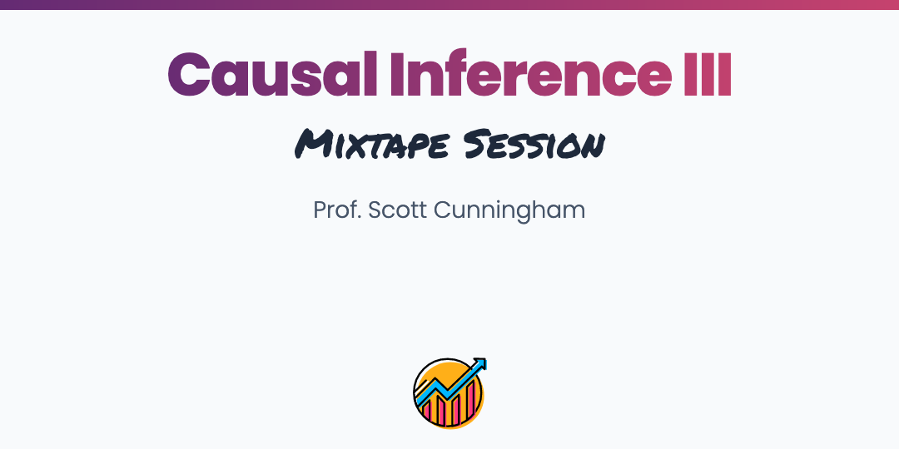

 

## About

Synthetic control has been called the most important innovation in causal inference of the last two decades (Athey and Imbens 2018). It's use has been seen across the social sciences but even industry and government agencies. The method combines many design elements from unconfoundedness principles to difference-in-differences estimation to help find suitable estimates of counterfactuals in panel settings. Each day is 8 hours with 15 minute breaks on the hour plus an hour for lunch. We will review the theory behind several estimators, go into detail on the intuition of the estimation strategies and identification itself, as well as explore code in R and Stata and applications using these methods. The goal as always is that participants leave the workshop with competency and confidence. This class will be a sequel to the Causal Inference I and II.

### Slides

The full slide set is contained [here](https://github.com/Mixtape-Sessions/Causal-Inference-3/blob/main/Slides/Synthetic-Control.pdf).

### Coding Labs

The main coding lab reanalyzes data from a natural experiment in Texas where for three years – 1993, 1994, 1995 – operational capacity expanded 35% per year causing its overall operational capacity to approximately double in three years. We use the 1993-1995 expansion as a natural experiment to examine the effect of prison expansion on incarceration rates. As an extension, we also analyze this dataset using the new `R` package, `augsynth`.

